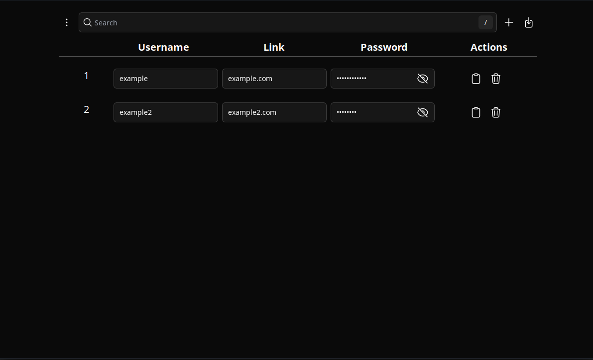

# Password Manager
A simple manager for storing passwords



# Installation
Check [release](https://github.com/Mark-Asuncion/password-manager/releases/tag/Release) for the pre-built application

# Building
## Requirements
- Nodejs >= v20.10.0
- Rust >= 1.75.0
```bash
# On the cloned folder install the dependencies
npm i
```
# Build Development
```bash
cargo tauri dev
```
# Build Release
```bash
# check 'cargo tauri build --help' for more info about options
cargo tauri build
```
